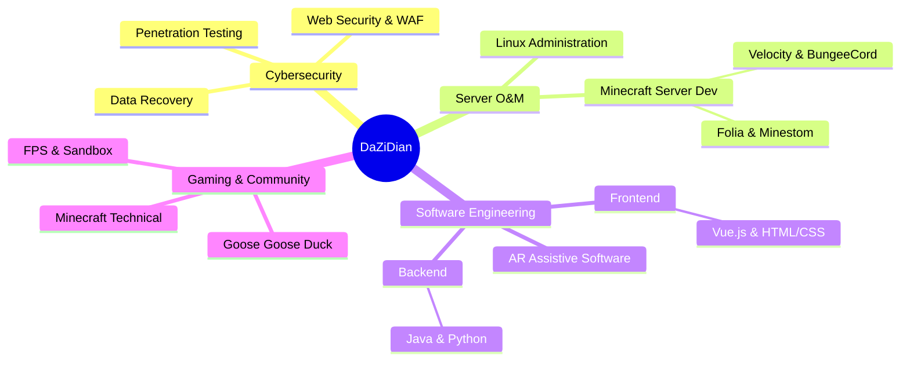

  

   

  

   

  
  
  

---

## ⚡ 关于我 | About Me

<table>
  <tr>
    <td width="50%" valign="top">
      <h3><code>whoami</code></h3>
      <ul>
        <li>🏫 Currently studying at <b>SDCIT</b>, majoring in Network Security Technology. <i>SDCIT在校生，主修网络安全技术。</i></li>
        <li>🛡️ Focused on cybersecurity, penetration testing, firewall, data recovery, and server O&M. <i>专注于网络安全、渗透测试、防火墙、数据恢复及服务器运维。</i></li>
        <li>⛏️ A Minecraft Developer, deeply involved in TMC. Familiar with Folia, Velocity;Co-Founder and CEO of DarkStation. <i>深耕技术生存（生电），熟悉 Folia、Velocity 等高并发架构，DarkStation 联合创始人兼首席执行官。</i></li>
        <li>🌟 Microsoft Student Ambassador. Dedicated to AI, Big Data, and AR assistive software. <i>微软学生大使，致力于 AI、大数据及 AR 辅助软件系统的开发。</i></li>
        <li>🎮 Love Minecraft, FPS, sandbox games, and Goose Goose Duck. <i>热爱 Minecraft、FPS、沙盒游戏以及与社区朋友开黑 Goose Goose Duck。</i></li>
      </ul>
    </td>
    <td width="50%" valign="top">
      <h3><code>current signal</code></h3>
      <pre><code>Role        Cybersec Engineer / Server Dev
Focus       Web Sec / Big Data / AI
Languages   Java / JS / C++ / Rust / Python
Tools       VS Code / IntelliJ / Linux
Timezone    Asia/Shanghai
Contact     daz1d1an (Discord/TG)</code></pre>
    </td>
  </tr>
</table>

---

## 🧩 核心技术栈 | Core Stack

---

## 🛠️ 常用工具 | Lab Tools

  
  &nbsp;&nbsp;
  
  &nbsp;&nbsp;
  
  &nbsp;&nbsp;
  
  &nbsp;&nbsp;
  
  &nbsp;&nbsp;
  
  &nbsp;&nbsp;
  
  &nbsp;&nbsp;
  
  &nbsp;&nbsp;
  
  &nbsp;&nbsp;
  
  &nbsp;&nbsp;
  

---

## 🌐 社交频道 | Connect

---

## 📊 GitHub 数据 | Dashboard

  
  
   
  
   
  

---

